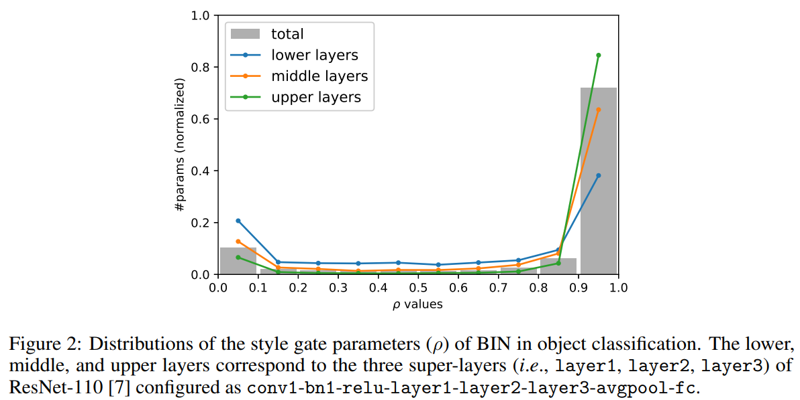
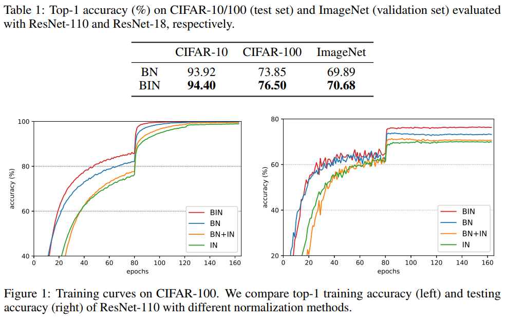
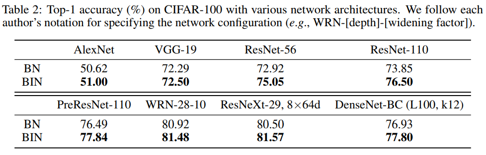
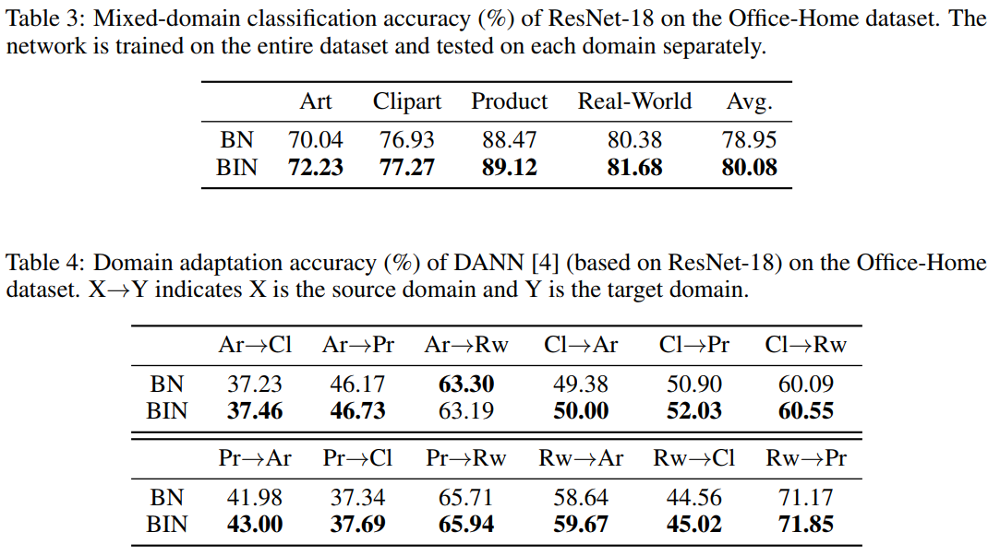
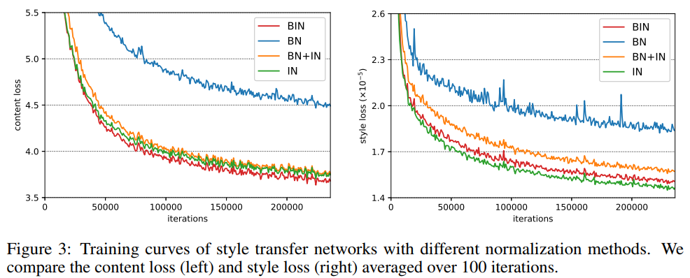
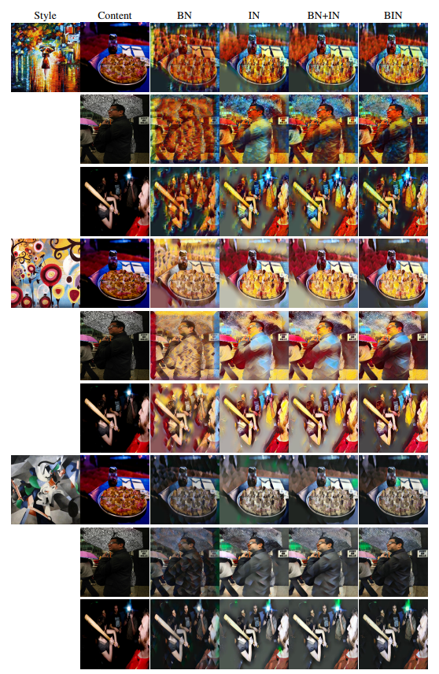

# Batch_Instance_Normalization-Tensorflow
Simple Tensorflow implementation of [Batch-Instance Normalization](https://arxiv.org/abs/1805.07925)

## Code
```python

import tensorflow as tf

def batch_instance_norm(x, scope='batch_instance_norm'):
    with tf.variable_scope(scope):
        ch = x.shape[-1]
        eps = 1e-5

        batch_mean, batch_sigma = tf.nn.moments(x, axes=[0, 1, 2], keep_dims=True)
        x_batch = (x - batch_mean) / (tf.sqrt(batch_sigma + eps))

        ins_mean, ins_sigma = tf.nn.moments(x, axes=[1, 2], keep_dims=True)
        x_ins = (x - ins_mean) / (tf.sqrt(ins_sigma + eps))

        rho = tf.get_variable("rho", [ch], initializer=tf.constant_initializer(1.0), constraint=lambda x: tf.clip_by_value(x, clip_value_min=0.0, clip_value_max=1.0))
        gamma = tf.get_variable("gamma", [ch], initializer=tf.constant_initializer(1.0))
        beta = tf.get_variable("beta", [ch], initializer=tf.constant_initializer(0.0))

        x_hat = rho * x_batch + (1 - rho) * x_ins
        x_hat = x_hat * gamma + beta

        return x_hat
        
```

## Usage

```python
with tf.variable_scope('network') :
    x = conv(x, scope='conv_0')
    x = batch_instance_norm(x, scope='bin_norm_0')
    x = relu(x)
```

## Distribution of ρ


## Results
### Classification



## Domain Adaptation


## Style Transfer



## Related works
* [Switchable_Normalization](https://github.com/taki0112/Switchable_Normalization-Tensorflow)

## Author
Junho Kim
